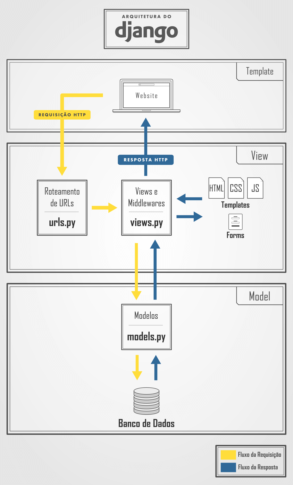
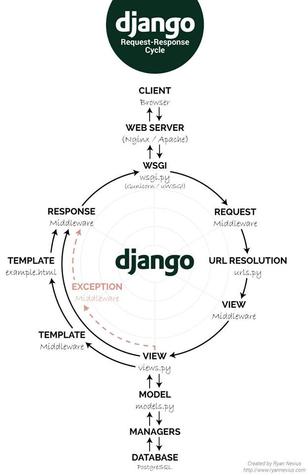

O objetivo desse repositório é organizar os principais comandos do Django para o desenvolvimento de uma aplicação Web
# Django
- Documentação: [Projeto Django](https://www.djangoproject.com/) 
## Desenvolvimento Web
Django é um framework para aplicações web gratuito e de código aberto, escrito em Python. Um web framework é um conjunto de componentes que ajuda você a desenvolver sites de forma mais rápida e fácil. Utiliza o padrão model-template-view (MTV)
## Arquitetura 

## Fluxograma

### Referências

[Ebook Desenvolvimento Python](https://pythonacademy.com.br/assets/ebooks/desenvolvimento-web-com-python-e-django/desenvolvimento-web-com-python-e-django.pdf)
